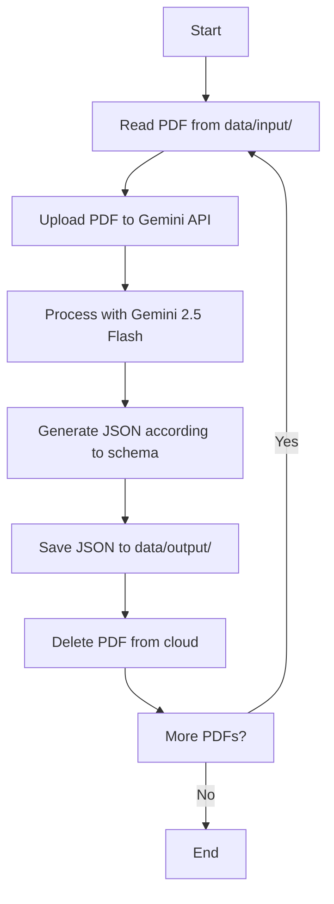

# PDF Processing Plan for Digital Twin Research Project

## Overview
This plan outlines the step-by-step approach for processing scientific PDF articles and converting them into structured JSON files using Google's Gemini API. Each PDF will be processed individually, with automatic cleanup of cloud resources after processing.

## Workflow Pattern
For each PDF file, the workflow follows this pattern:
1. **Upload** a single PDF file to Gemini API
2. **Process** the PDF with Gemini 2.5 Flash model to extract structured information
3. **Generate** a JSON file according to the schema defined in `prompt.md`
4. **Delete** the uploaded file from the cloud to clean up resources
5. **Repeat** for the next PDF file

## Key Features
- **Individual Processing**: Each PDF is processed separately with its own API request
- **Automatic Cleanup**: Files are deleted from the cloud immediately after processing
- **Error Handling**: Robust error handling for upload, processing, and deletion steps
- **Sequential Processing**: PDFs are processed one at a time to avoid overwhelming the API
- **Structured Output**: JSON files will follow the exact schema from `prompt.md`

## Implementation Steps

### Step 1: Set up the environment and test basic Gemini API connectivity with gemini-2.5-flash model
- Install required packages (google-genai, etc.)
- Test API connectivity with the existing API key
- Verify the gemini-2.5-flash model is accessible

### Step 2: Create a PDF processing function that uploads a single PDF file to Gemini API
- Implement `upload_pdf_to_gemini(pdf_path)` function
- Handle file upload and return file metadata
- Include error handling for upload failures

### Step 3: Implement JSON schema generation based on prompt.md requirements for single paper processing
- Parse the JSON schema from `prompt.md`
- Create a prompt template that includes the schema requirements
- Include project context and section mapping information

### Step 4: Create a function to process one PDF (upload → analyze with Gemini → generate JSON → delete from cloud)
- Implement `process_single_pdf(pdf_path, section_code, sequence_id)` function
- Upload PDF to Gemini API
- Send analysis request with structured prompt
- Parse and validate JSON response
- Delete uploaded file from cloud
- Save JSON output to appropriate location

### Step 5: Test the single PDF processing with one file from data/input/3.1/ (e.g., 1.pdf)
- Test with `data/input/3.1/1.pdf`
- Verify all steps work correctly
- Check output JSON structure and content

### Step 6: Verify the output JSON structure matches the required schema from prompt.md
- Validate JSON schema compliance
- Check all required fields are present
- Ensure proper formatting and data types

### Step 7: Add error handling for upload, processing, and deletion steps
- Implement try-catch blocks for each operation
- Add retry logic for transient failures
- Log errors appropriately without stopping the entire process

### Step 8: Create a function to iterate through PDFs in a directory and process them sequentially
- Implement `process_pdfs_in_directory(directory_path)` function
- Extract section code and sequence ID from file paths
- Process each PDF one by one
- Track progress and handle failures gracefully

### Step 9: Test processing multiple PDFs one by one from data/input/3.1/
- Test with all PDFs in `data/input/3.1/`
- Monitor resource usage and API rate limits
- Verify all JSON files are generated correctly

### Step 10: Create a main script that orchestrates the complete workflow with logging
- Create `main.py` or similar entry point
- Add command-line argument parsing
- Implement comprehensive logging
- Add progress reporting and summary statistics

## Workflow Diagram



## File Structure
```
dt-report-2025/
├── data/
│   ├── input/
│   │   ├── 3.1/
│   │   │   ├── 1.pdf
│   │   │   ├── 2.pdf
│   │   │   └── ...
│   │   └── 3.2/
│   └── output/
│       ├── 3.1-001.json
│       ├── 3.1-002.json
│       └── ...
├── prompt.md
├── pdf-processing-plan.md
├── main.py
└── utils/
    ├── pdf_processor.py
    └── config.py
```

## JSON Output Schema
The generated JSON files will follow the exact structure defined in `prompt.md`:
- `paper_id`: Combined section code and zero-padded sequence ID
- `project_context`: Section code and description
- `metadata`: Paper title, authors, year, publication venue, DOI
- `summary`: Problem statement, objective, key contribution
- `methodology`: Approach type, technologies, method summary
- `results_and_evaluation`: Key findings, evaluation metrics
- `relevance_to_my_project`: Direct applicability, relevance score, cited ideas
- `keywords`: 5-7 most important keywords

## Success Criteria
- All PDF files are processed successfully
- Generated JSON files follow the exact schema requirements
- No files remain on Gemini cloud storage after processing
- Error handling prevents single failures from stopping the entire process
- Clear logging and progress reporting throughout the process